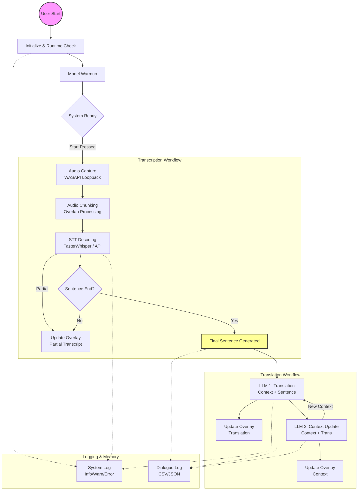

/document
│
├─ 00_project_overview.md              ← 專案總覽與願景
├─ 01_architecture_overview.md         ← 整體架構圖與流程說明（對應你上傳的流程圖）
├─ 02_modules_specification.md         ← 各模塊功能、依賴、接口定義
├─ 03_gui_overlay.md                   ← PyQt/PySide GUI 與 Overlay 設計文件
├─ 04_transcription_system.md          ← STT 模組（FasterWhisper / API）設計
├─ 05_translation_system.md            ← LLM 翻譯模組與情境上下文管理
├─ 06_context_memory.md                ← 維持語境與翻譯品質
├─ 07_audio_input_capture.md           ← 系統音源截取與輸入流處理設計
├─ 08_runtime_check.md                 ← RUNTIME/模型檢查與提示機制
├─ 09_system_logging.md                ← LOG 系統與顏色分類規範
├─ 10_dialogue_logging.md              ← 語料紀錄層使用規範
├─ 11_config_json_spec.md              ← config.json 結構與設定說明
├─ 12_performance_targets.md           ← 性能與延遲優化目標 (0.5~1.5s pipeline)
├─ 13_dev_environment_setup.md         ← 環境設置、依賴、建構步驟
└─ 14_future_expansion.md              ← 後續擴充構想與 API 替換策略

## System Workflow

